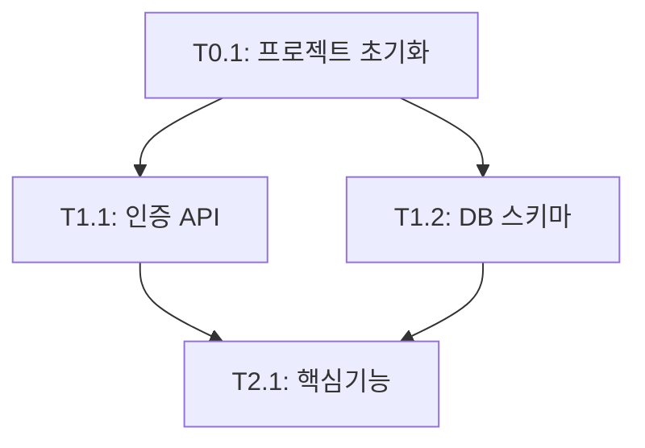

# Planning Document Standards

모든 기획 문서는 `docs/planning/` 디렉토리에 저장하며, 일관된 형식을 따릅니다.

## 문서 파일명 규칙

기획 문서는 다음 순서와 명명 규칙을 따릅니다:

| 번호 | 파일명 | 설명 |
|------|--------|------|
| 01 | `01-prd.md` | Product Requirements Document (제품 요구사항 정의서) |
| 02 | `02-trd.md` | Technical Requirements Document (기술 요구사항 정의서) |
| 03 | `03-user-flow.md` | User Flow (사용자 플로우) |
| 04 | `04-database-design.md` | Database Design (데이터베이스 설계) |
| 05 | `05-design-system.md` | Design System (디자인 시스템) |
| 06 | `06-tasks.md` | TASKS (태스크 목록) |
| 07 | `07-coding-convention.md` | Coding Convention (코딩 컨벤션) |

## 필수 문서

최소한 다음 문서는 반드시 작성되어야 합니다:

- **01-prd.md**: 무엇을 만들 것인가?
- **02-trd.md**: 어떤 기술로 만들 것인가?
- **06-tasks.md**: 어떤 순서로 만들 것인가?

## 각 문서의 필수 섹션

### 01-prd.md (Product Requirements Document)

```markdown
# {프로젝트명} - PRD

## 1. 제품 개요
- 목적
- 타겟 사용자
- 핵심 가치 제안

## 2. MVP 범위
- 포함되는 기능
- 포함되지 않는 기능 (v2 이후)

## 3. 핵심 기능
### 기능 1: {기능명}
- 설명
- 사용자 스토리
- 인수 조건

### 기능 2: {기능명}
...

## 4. 비기능 요구사항
- 성능
- 보안
- 확장성

## 5. 제약 사항
- 기술적 제약
- 비즈니스 제약
```

### 02-trd.md (Technical Requirements Document)

```markdown
# {프로젝트명} - TRD

## 1. 기술 스택
### Frontend
- Framework: React / Next.js / SvelteKit
- State Management: Zustand / Redux
- Styling: Tailwind CSS

### Backend
- Framework: FastAPI / Express / Rails
- Database: PostgreSQL / MySQL / MongoDB
- Cache: Redis (optional)

### DevOps
- Containerization: Docker
- CI/CD: GitHub Actions

## 2. 아키텍처
- 시스템 구성도
- API 설계 원칙
- 데이터 흐름

## 3. 보안 요구사항
- 인증: JWT / Session
- 권한 관리
- 데이터 암호화

## 4. 성능 목표
- 응답 시간
- 동시 접속자 수
- 데이터베이스 쿼리 최적화

## 5. 인프라
- 개발 환경
- 스테이징 환경
- 프로덕션 환경
```

### 06-tasks.md (TASKS)

```markdown
# TASKS: {프로젝트명} - AI 개발 파트너용 태스크 목록

## MVP 캡슐
1. **목표**: ...
2. **페르소나**: ...
3. **핵심 기능**: ...
4. **제외 기능**: ...
5. **성공 지표**: ...
6. **기술 스택**: ...
7. **일정**: ...
8. **위험 요소**: ...
9. **의존성**: ...
10. **다음 단계**: ...

---

## 마일스톤 개요

| 마일스톤 | 설명 | 주요 기능 | Phase |
|----------|------|-----------|-------|
| M0 | 프로젝트 셋업 | 환경 구성 | Phase 0 |
| M1 | FEAT-0 공통 흐름 | 인증, DB 스키마 | Phase 1 |
| M2 | FEAT-1 핵심기능 | 주요 기능 구현 | Phase 2 |
...

---

## M0: 프로젝트 셋업 (Phase 0)

### [] T0.1: 프로젝트 초기화
**담당**: orchestrator
**Git**: main 브랜치
**산출물**:
- 프로젝트 구조
- 의존성 설치
- 환경 설정 (.env, docker-compose.yml)

---

## M1: FEAT-0 공통 흐름 (Phase 1)

### [] Phase 1, T1.1: {기능명} RED→GREEN
**담당**: {specialist}

**Git Worktree 설정**:
```bash
git worktree add ../{프로젝트}-phase1-{기능} -b phase/1-{기능}
```

**TDD 사이클**:
1. RED: 테스트 작성
2. GREEN: 구현
3. REFACTOR: 정리

**산출물**: ...
**인수 조건**: ...
**병렬 실행**: T1.2와 병렬 가능

---

## 의존성 그래프



## 병렬 실행 가능 태스크

| 태스크 | 병렬 실행 가능 |
|--------|----------------|
| T1.1, T1.2 | ✅ 독립적 |
| T2.1 | ❌ T1.1, T1.2 완료 후 |
```

## MVP 캡슐 작성 원칙

MVP 캡슐은 10개 항목으로 구성되며, 프로젝트의 핵심을 한눈에 파악할 수 있도록 작성합니다:

1. **목표**: 한 문장으로 프로젝트의 목적 정의
2. **페르소나**: 주요 사용자 정의
3. **핵심 기능**: MVP에 포함되는 3~5개 핵심 기능
4. **제외 기능**: v2 이후로 미루는 기능 명시
5. **성공 지표**: 측정 가능한 KPI
6. **기술 스택**: 사용할 기술 명시
7. **일정**: 예상 개발 기간
8. **위험 요소**: 예상되는 기술적/비즈니스 리스크
9. **의존성**: 외부 API, 라이브러리 의존성
10. **다음 단계**: MVP 완료 후 계획

## 문서 생성 워크플로우

기획 문서는 다음 워크플로우를 통해 생성됩니다:

1. **Socrates 워크플로우** (`/socrates`)
   - 21개 질문을 통해 요구사항 수집
   - 6개 기획 문서 자동 생성 (01~05, 07)
   
2. **Tasks Generator 워크플로우** (`/tasks-generator`)
   - 기획 문서를 읽고 TASKS.md (06) 생성
   - TDD 규칙 및 Git Worktree 전략 적용

## 문서 업데이트 규칙

- **PRD/TRD 변경**: 주요 방향 전환 시에만 업데이트
- **TASKS 변경**: 태스크 추가/변경 시 즉시 업데이트
- **버전 관리**: 문서 하단에 "Update History" 섹션 추가

예시:
```markdown
## Update History
- 2026-01-14: Phase 2 태스크 추가 (T2.1~T2.5)
- 2026-01-10: 초안 작성
```

## 관련 워크플로우

- `.agent/workflows/socrates.md`: 21개 질문을 통한 기획 문서 생성
- `.agent/workflows/tasks-generator.md`: TASKS.md 자동 생성
- `.agent/workflows/project-bootstrap.md`: 프로젝트 구조 생성

## 관련 규칙

- `.agent/rules/tdd-workflow.md`: 태스크 작성 시 TDD 규칙 적용
- `.agent/rules/git-conventions.md`: Git Worktree 전략
