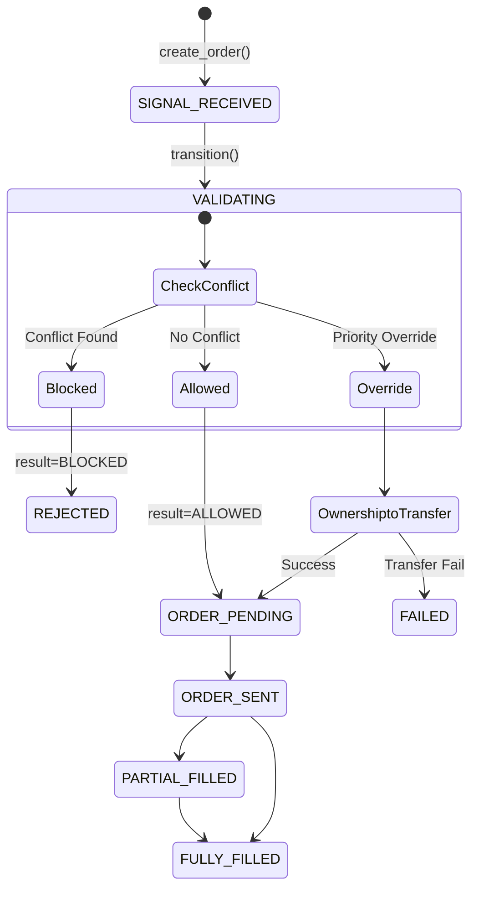

# Order Manager Integration Scenarios (T4.1)

작성일: 2026-01-12
작성자: Gemini Agent

## 1. 개요
Order Manager와 Conflict Detector, Ownership Service 간의 통합 시나리오 및 상태 전이 흐름을 정의합니다.

## 2. 통합 시나리오

### 시나리오 1: 주문 차단 (Blocking)
*   **상황**: 낮은 우선순위 전략이 높은 우선순위 전략이 소유한 종목의 매수를 시도.
*   **흐름**:
    1.  **주문 생성 요청**: `OrderManager.create_order()` 호출
    2.  **초기 상태**: `SIGNAL_RECEIVED` 상태로 DB 레코드 생성 (ID 발급)
    3.  **검증 진입**: `VALIDATING` 상태로 전이
    4.  **충돌 검사**: `ConflictDetector.check_conflict()` -> 결과: `BLOCKED`
    5.  **차단 처리**:
        *   주문 상태를 **`REJECTED`**로 전이
        *   사유(`reason`)에 충돌 상세 내용 기록
    6.  **결과 반환**: 생성된 주문 객체 반환 (Status: REJECTED)

### 시나리오 2: 정상 진행 (Pass)
*   **상황**: 충돌 없음.
*   **흐름**:
    1.  **주문 생성 요청**: `OrderManager.create_order()` 호출
    2.  **초기 상태**: `SIGNAL_RECEIVED`
    3.  **검증 진입**: `VALIDATING`
    4.  **충돌 검사**: `ConflictDetector.check_conflict()` -> 결과: `ALLOWED`
    5.  **승인 처리**:
        *   주문 상태를 **`ORDER_PENDING`**으로 전이
    6.  **결과 반환**: 생성된 주문 객체 반환 (Status: ORDER_PENDING) -> 이후 `ORDER_SENT`로 진행 예정

### 시나리오 3: 우선순위 오버라이드 (Override)
*   **상황**: 높은 우선순위 전략이 낮은 우선순위 전략의 소유권을 가져옴.
*   **흐름**:
    1.  **주문 생성 요청**: `OrderManager.create_order()` 호출
    2.  **초기 상태**: `SIGNAL_RECEIVED` -> `VALIDATING`
    3.  **충돌 검사**: 결과: `PRIORITY_OVERRIDE`
    4.  **소유권 이전**: `OwnershipService.transfer_ownership()`
        *   성공 시: 로그 기록
        *   실패 시: `REJECTED` 또는 `FAILED` 전이
    5.  **승인 처리**:
        *   주문 상태를 **`ORDER_PENDING`**으로 전이
    6.  **결과 반환**: 생성된 주문 객체 반환 (Status: ORDER_PENDING)

## 3. State Machine Diagram

